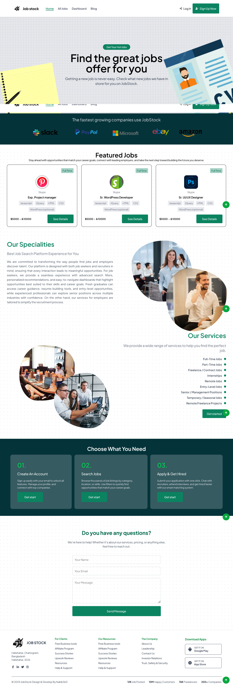
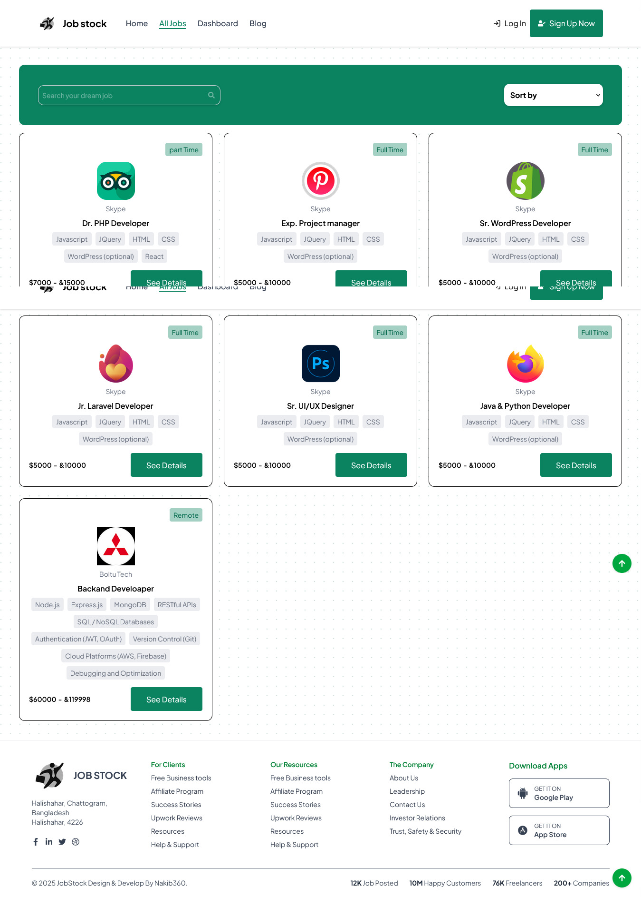

<h1 style="color: yellow; text-align: center;">Job Stock</h1>

It's a full stack website. A user can Post browse jobs. He can see details. Can apply for any job he want. He can make this details user profile based on his skills. The have a Admin panel. Which is only accesable by admin of this site. This site have a wonderful UI. Which make the look of this site batter.

<h2 style="color: yellow;">Pages</h2>
<ol>
    <li>Home</li>
    <li>All Jobs</li>
    <li>Dashboard</li>
    <li>Blog</li>
    <li>Admin Panel</li>
    <li>Sign Up</li>
</ol>

<h3 style="color: yellow;">Home</h3>

    

It is the home page. In the top i used framer motion make a animation. Than sponsor section. Than Featured Jobs section. In the featured job section it will show random 3 jobs automatically from the jobs DB. Than our specialities. In the right side a animated image doing up and down. Than Our services section. In the left side also a animated image doing up and down by motion. Than choose What You need. Than Query section. At the last A footer section. 

<h3 style="color: yellow;">All Jobs</h3>

    

It is the All Jobs Page. In the top i used framer motion make a animation. Than sponsor section. Than Featured Jobs section. In the featured job section it will show random 3 jobs automatically from the jobs DB. Than our specialities. In the right side a animated image doing up and down. Than Our services section. In the left side also a animated image doing up and down by motion. Than choose What You need. Than Query section. At the last A footer section. 
